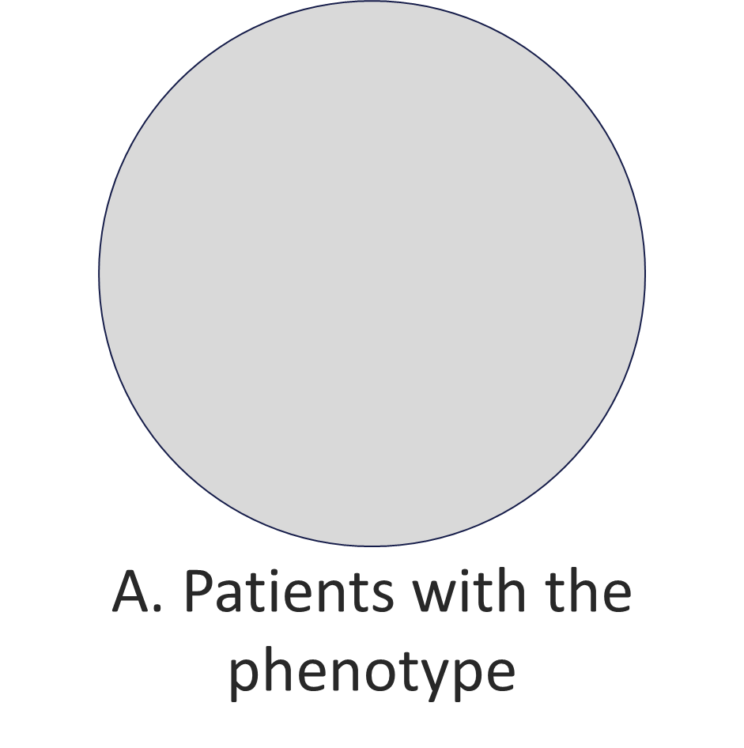
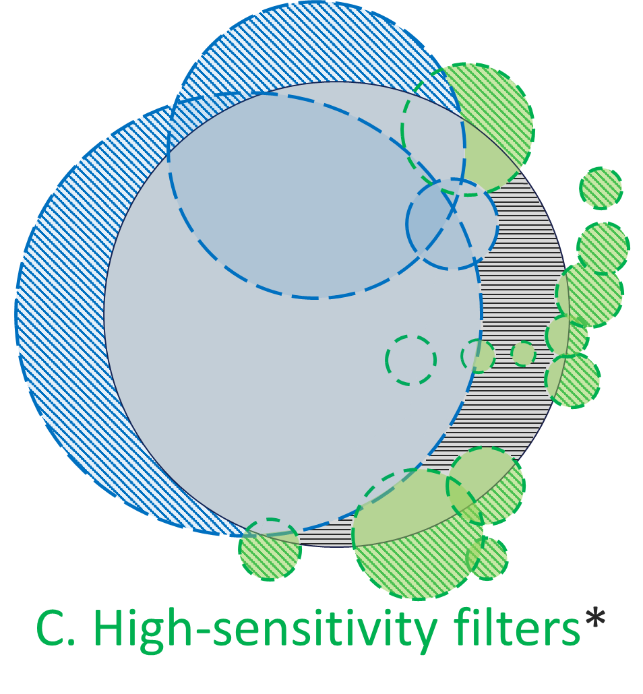

# High Sensitivity Filter

Improve identification of patients with a phenotype of interest (A):

* (B)...over and above traditional filtering approaches that identify presumptive cases using small sets of disease-specific diagnosis codes that are reasonably specific but overlook some true cases 
* (C)...via a data-driven approach for discovering other coded data that may serve as surrogates to traditional filters
* ...thereby improving overall sensitivity at reasonable cost in specificity, illustrated using a COVID-19 phenotype.

  
  
  

## Table of Contents

* [Getting Started](#getting-started)
  * [Prerequisites](#prerequisites)
  * [Usage](#usage)
* [Roadmap](#roadmap)

## Getting Started

### Prerequisites

* SAS version 9.4+
* Download included SAS code from this directory
* R version ?
* Retrieve modified PheNorm code from here: TODO
* Sentinel Data Model ??

### Usage

* Modify the SAS code to ...

## Roadmap

* Update this documentation
* Upload code in shareable way
* Detail steps for running
* Detail expected data dictionary
